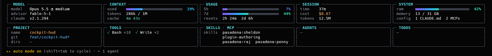

# modern-hud

A btop-style instrument panel for the Claude Code status line. It takes every
reading [claude-hud](https://github.com/jarrodwatts/claude-hud) collects and
draws it as a grid of framed gauges instead of lines of text.



## Requirements

- Node.js 24.2 or newer (the TypeScript sources run directly, no build step)
- The [claude-hud](https://github.com/jarrodwatts/claude-hud) plugin installed —
  modern-hud reuses its data collection and its `config.json`
- A terminal at least 124 columns wide; on a narrower one the stock claude-hud
  output is shown instead

## Install

```sh
git clone https://github.com/dmytro-rudenko/modern-hud.git ~/modern-hud
```

Then point the status line in `~/.claude/settings.json` at it:

```json
{
  "statusLine": {
    "type": "command",
    "command": "bash -c 'cols=$(stty size </dev/tty 2>/dev/null | cut -d\" \" -f2); export COLUMNS=$(( ${cols:-120} - 4 )); exec node \"$HOME/modern-hud/statusline.ts\"'",
    "refreshInterval": 2
  }
}
```

`refreshInterval` re-runs the panel every 2 seconds so the cache countdown and
RAM gauge keep moving.

## Behaviour

- Readings switched off in claude-hud's `display` config disappear here too.
- A panel with no data keeps its frame and shows `—`.
- Long values wrap; nothing is truncated.
- If claude-hud changes its internal data shape, modern-hud falls back to the
  stock claude-hud output and prints `modern-hud: fallback (...)`.

## Development

```sh
npm install
npm test
npm run typecheck
```

## License

[MIT](LICENSE)
